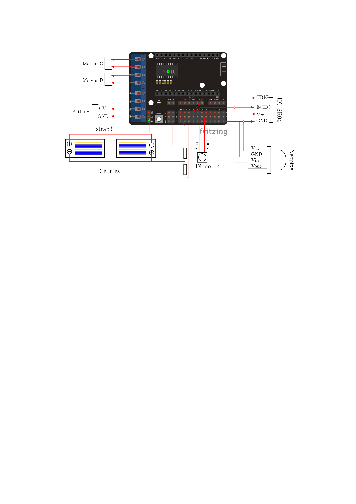

# Introduction
Ce projet est une adapatation de la voiture 2 roues Anumby 2021 dans laquelle la commande par le smartphone est remplacée par une télécommande infrarouge. Les fonctionnalités restent les mêmes. Le robot possède 3 modes de fonctionnement :
- __le mode MANUEL__ : les déplacements sont commandés par les flèches de la télécommande (^=avance, v=recule, <=à gauche, >=à droite)
- __le mode COLLISION__ : la voiture avance seule. Lorsqu'elle rencontre un osbtacle, elle tourne aléatoirement à gauche ou à droite s'il n'est pas trop près, sinon elle recule. Puis elle reprend sa progression. La distance de l'obstacle est mesurée avec le capteur ultrason.
- __le mode SUIVI__ : la voiture avance guidée par les deux cellules photovoltaïques (gauche et droite). Si une différence d'éclairement est détectée, elle tourne pour se diriger vers la source de lumière (à gauche si eclairement(gauche) > eclairement(droit), à droite si eclairement(gauche) < eclairement(droit), tout droit sinon).

  Le mode de fonctionnement est indiqué par la couleur de la diode neopixel fixée sur la capteur ultrason: MANUEL=rouge, COLLISION=bleu, SUIVI=jaune.

# Liste de materiel:
- __ESP8266 Nodemcu__ : https://fr.aliexpress.com/item/32659028315.html?spm=a2g0o.order_list.order_list_main.51.5f2c5e5bFkj0JY&gatewayAdapt=glo2fra
- __shield moteur L293D__ : https://fr.aliexpress.com/item/1005003186128473.html?spm=a2g0o.order_list.order_list_main.45.5f2c5e5bFkj0JY&gatewayAdapt=glo2fra
- __capteur ultrason HC-SR04__
- __diode IR TL1838__ : https://fr.aliexpress.com/item/4000610270256.html?spm=a2g0o.order_list.order_list_main.114.5f2c5e5bFkj0JY&gatewayAdapt=glo2fra
- __diode neopixel__
- __2 cellules photovoltaïques 05V__ : https://fr.aliexpress.com/item/32814941048.html
- __telecommande IR__ : https://fr.aliexpress.com/item/1005005880586343.html?spm=a2g0o.order_list.order_list_main.5.50145e5bUaWUCF&gatewayAdapt=glo2fra
- __2 résistances de 1k ou 10 k__

# Schema electrique

