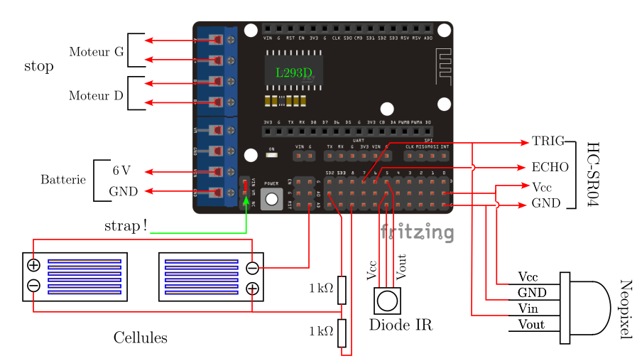

# Introduction
Ce projet est une adapatation de la voiture 2 roues Anumby 2021 dans laquelle la commande par le smartphone est remplacée par une télécommande infrarouge. Les fonctionnalités restent les mêmes. Le robot possède 3 modes de fonctionnement :

# Schema electrique

