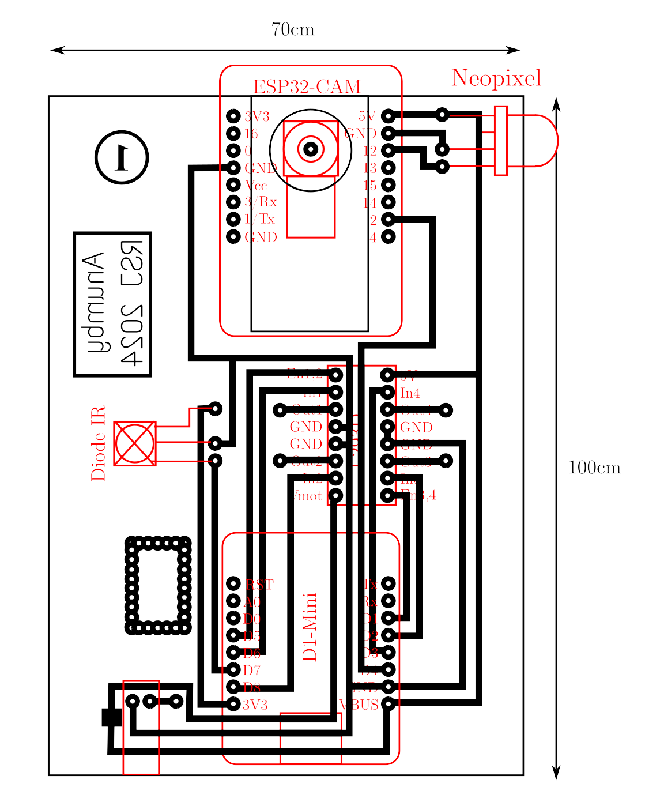

La version 2024 robot du Servive Jeunesse est guidée par télécommande infra-rouge. Elle embarque une caméra et peut envoyer des photos 
vers un ordinateur fixe dans le but d'effectuer une reconnaissance d'image à l'aide d'un algorithme 
d'intelligence artificielle.

## Liste de materiel:
- __D1 Mini (ESP8266)__ : (aliexpress)
- __driver moteur L293D__ : https://www.gotronic.fr/art-l293d-14072.htm
- __ESP32-cam__ :  (aliexpress)
- __diode IR TL1838__ (ou équivalent): https://fr.aliexpress.com/item/4000610270256.html?spm=a2g0o.order_list.order_list_main.114.5f2c5e5bFkj0JY&gatewayAdapt=glo2fra
- __diode neopixel__ : https://www.gotronic.fr/art-5-leds-rgb-5mm-neopixel-ada1938-22883.htm
- __diode schottky__ : https://www.gotronic.fr/art-1n5819-104.htm
- __telecommande IR H713__ : (aliexpress)

## Schema electrique

  

Le circuit électrique utilise deux microcontroleurs : 
- un ESP8266 (D1 Mini) pour la réception du signal infra-rouge et la commande des moteurs,
- un ESP32-cam pour la capture des images. __Attention__ : l'objectif de la caméra étant tourné vers le sol, les broches de l'ESP32-cam doivent être inversées, c'est à
  dire placées du côté caméra et non du côté carte SD (photo ci-dessous).

  
  

  
Les deux microcontrolleurs sont alimentés en 5V par la même source : 4 piles 1,5V ou 4 accus NiMh de 1,2V.

  

## Firmwares pour le D1 mini et pour l'ESP32-cam

Voir les dossiers correspondants

## Fonctionnement

